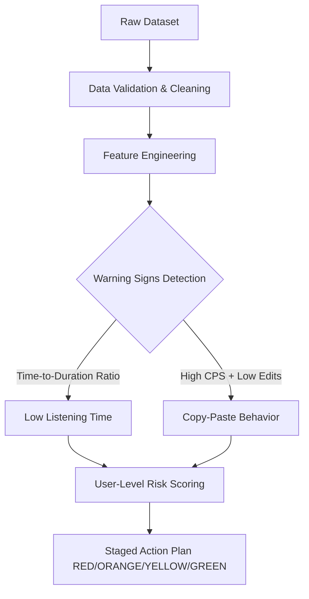

<div align="center">
  <h1>🎙️ Josh Talks AI: Transcriber Quality Evaluation</h1>
  <p><i>A Data-Driven Quality Control Framework for ASR Datasets</i></p>
  
  
  
  
</div>

---

## 🎯 Purpose
This project evaluates the quality of human transcribers using objective **data signals** rather than manual review. The goal is to automatically identify suspicious transcribers who rush tasks, barely review audio, or make minimal effort, thereby protecting the integrity of AI training datasets (like Whisper AI).

---

## 🚀 Automated Workflow



---

## 📂 Project Structure
```text
📦 JoshTalks_Q2_Transcriber_Quality_Evaluation
 ┣ 📂 01_Raw_Data          # Drop your transcription_data.csv here
 ┣ 📂 02_Data_Cleaning     # Output for validated/cleaned data
 ┣ 📂 03_Analysis          # Methodology & Feature Engineering logic
 ┣ 📂 04_Visualizations    # Target folder for generated charts
 ┣ 📂 05_Part_I            # Detailed Warning Signs breakdown
 ┣ 📂 06_Part_II           # Staged Risk Model & Blocking logic
 ┣ 📂 07_Final_Report      # Comprehensive Q2 Final Report
 ┣ 📂 08_Screenshots       # Dataset limitation notices
 ┣ 📂 09_Metadata          # Dataset schema & specifications
 ┣ 📜 README.md            # You are here
 ┣ 📜 requirements.txt     # Python dependencies
 ┗ 📜 run_analysis.py      # Main executable script
```

---

## ⚠️ Dataset Availability Note
> **Data-Unavailable Version:** The actual Q2 dataset was not provided in the assignment. This repository contains the complete analytical framework, formulas, and staging logic. **No synthetic/fake data was fabricated.** The thresholds outlined are proposed frameworks ready for calibration once real data is supplied.

---

## 🛠️ How to Use

1. **Install Dependencies:**
   ```bash
   pip install -r requirements.txt
   ```
2. **Add Data:**
   Place the real `transcription_data.csv` inside the `01_Raw_Data/` folder.
3. **Run Analysis:**
   ```bash
   python run_analysis.py
   ```
*(If run without data, the script will safely warn you and exit without crashing.)*

---
<div align="center">
  <b>Built for Josh Talks AI Assignment</b>
</div>
